<!-- Profile README for Debjyoti Ghosh | AI/ML · Cybersecurity · Research · Backend Engineering -->

 

  
  
  
  

---

## 👋 About Me

I'm **Debjyoti Ghosh**, a fourth-year B.Tech Computer Science and Information Technology student at **UEM Kolkata** (expected 2027). I build across **AI/ML, cybersecurity, applied research, and backend engineering**.

I enjoy taking projects end-to-end: understanding the problem, testing approaches, building the data and API layers, integrating models, and thinking through deployment and reliability.

- 🤖 **AI/ML:** deep learning, NLP, computer vision, time-series forecasting, and LLM applications
- 🛡️ **Security:** threat intelligence workflows, multi-tenant services, and access-control design
- 🔬 **Research:** multimodal deepfake detection, voice biometrics, and context-aware NLP
- ⚙️ **Backend:** Python APIs, database-backed applications, asynchronous tasks, and WebSockets
- 🏆 Completed **Amazon ML Summer School 2025**
- 📄 Recognized for multimodal deepfake detection research at **IEEE INDICON 2025**

> I care about building systems that are useful, testable, secure, and maintainable—not just impressive demos.

## 🧭 What I Work On

<table>
<tr>
<td width="50%" valign="top">

### 🤖 AI & Machine Learning
- Supervised and unsupervised learning
- Deep learning, NLP, and computer vision
- LLM applications and retrieval-augmented generation
- Forecasting, evaluation, and experimentation
- Multimodal features and model integration

</td>
<td width="50%" valign="top">

### 🛡️ Cybersecurity Engineering
- Threat monitoring and intelligence workflows
- Brand-abuse and identity signals
- Attack-surface and third-party risk concepts
- Multi-tenant architecture and RBAC
- Normalization, alerting, and backend reliability

</td>
</tr>
<tr>
<td width="50%" valign="top">

### 🔬 Research & Exploration
- Audio-visual deepfake detection
- Voice biometrics and audio features
- Context-aware post/comment classification
- Trustworthy AI and model validation
- Agentic workflows and Bayesian reasoning

</td>
<td width="50%" valign="top">

### ⚙️ Backend & Systems
- FastAPI, Flask, Django, and DRF
- REST APIs and WebSocket communication
- PostgreSQL, SQLite, and data modeling
- Asynchronous and background processing
- Docker, Git, and cloud deployment

</td>
</tr>
</table>

## 🚀 Selected Projects

<em>Selected work across applied AI, research, security, and developer tooling.</em>

<table>
<tr>
<td width="50%" valign="top">

### 📦 [InvenHub](https://github.com/debjyoti71/invenhub_NextAI)
Inventory management with data-driven workflows and an AI-assisted direction.

**Focus:** inventory operations, sales data, and application integration.

**Stack:** Python · Flask · Pandas · SQL

</td>
<td width="50%" valign="top">

### 📈 [SalesVision](https://github.com/debjyoti71/SalesVision)
Sales prediction and forecasting experiments using machine learning and time-series approaches.

**Focus:** feature engineering, predictive modeling, and forecast evaluation.

**Stack:** Python · LightGBM · Pandas · Time Series

</td>
</tr>
<tr>
<td width="50%" valign="top">

### 🎭 [Deepfake Detection](https://github.com/debjyoti71/deepfake_detection)
A computer-vision research project exploring detection of manipulated media.

**Focus:** visual features, deep learning, and media forensics.

**Recognition:** Multimodal deepfake detection research at IEEE INDICON 2025.

</td>
<td width="50%" valign="top">

### 🗣️ [Voice Recognition API](https://github.com/debjyoti71/voice_recognition_api)
API-oriented voice recognition and speaker-classification work.

**Focus:** audio features, speaker modeling, and inference integration.

**Stack:** Python · Audio ML · FastAPI

</td>
</tr>
<tr>
<td width="50%" valign="top">

### ⚽ [Sports Player Re-Identification](https://github.com/debjyoti71/Re-Identification_Sports_Footage)
A computer-vision project focused on identifying and tracking players across sports footage.

**Focus:** visual tracking and identity consistency across frames.

</td>
<td width="50%" valign="top">

### 🧩 [Dev Timekeeper](https://github.com/debjyoti71/time_extension)
A developer productivity extension for Visual Studio Code.

**Focus:** editor-integrated, offline-first productivity tooling.

</td>
</tr>
<tr>
<td width="50%" valign="top">

### ⚖️ [Elaina Legal AI](https://github.com/debjyoti71/Elaina_Legal_Ai)
An AI-oriented legal workflow project involving structured information and application logic.

**Focus:** legal workflows, client-facing experiences, and AI integration.

</td>
<td width="50%" valign="top">

### 🚗 [GaadiDiary](https://github.com/debjyoti71/GaadiDiary)
A personal vehicle and trip-tracking application.

**Focus:** vehicle records, trip logs, fuel, and maintenance tracking.

**Stack:** Django · SQLite

</td>
</tr>
</table>

  

## 🧪 Research Interests

| Area | Questions I find interesting |
|---|---|
| **Multimodal AI** | How can visual, temporal, and audio signals complement each other? |
| **Voice Biometrics** | How reliable is speaker recognition under noise and spoofing attempts? |
| **Context-aware NLP** | How does conversation context change the meaning of a post or comment? |
| **Trustworthy AI** | How can model outputs be validated, evaluated, and used responsibly? |
| **Agentic systems** | How should tools, retrieval, memory, and orchestration work together? |

## 🧰 Tools & Technologies

  <strong>Languages</strong> 
  

  <strong>ML / Data</strong> 
  
  
  
  
  

  <strong>Backend / Databases / DevOps</strong> 
  

## 📊 GitHub Overview

  
  

## 🤝 Connect

I'm interested in **AI/ML engineering, applied research, cybersecurity, and backend systems**.

  
  
  

  Dark navy × cyan · AI/ML · Cybersecurity · Research · Backend Engineering

